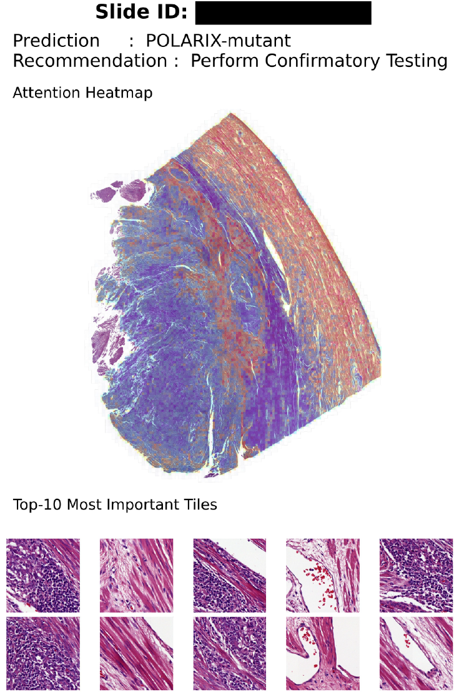

# POLARIX: _POLE_ Analysis through Rapid Image-based Screening in Endometrial Cancer


POLARIX is a deep learning model that predicts **_POLE_ mutation status** directly from **hematoxylin and eosin (H&E) whole slide images (WSIs)** in endometrial cancer. It combines calibrated decision thresholds with explainable AI methods to enable molecular screening for endometrial cancer, even in resource-constrained environments.

The model has been validated across multiple independent cohorts with **AUROC > 0.95**.

---

## Model Overview

**Architecture:** Attention-based Multiple Instance Learning (MIL)

**Training data:** Three randomized trials, six retrospective clinical cohorts, and two public datasets—the largest EC database compiled to date

**Task:** Binary classification (_POLE_-mutant vs _POLE_-wildtype)

**Explainability:** Attention heatmaps pinpoint morphologic features associated with _POLE_ mutations

**Output:** Calibrated prediction scores with LOW, MID, and HIGH decision thresholds for flexible deployment


---

## Installation

Set up a conda environment and install dependencies:

```bash
conda create -n polarix python=3.10
conda activate polarix
pip install -r requirements.txt
```

---

## Usage

### Preprocessing Whole-Slide Images with H-optimus-1

To extract tile-level features from WSIs for training and inference, use `extract_features.py`.

The model weights are downloaded directly from Hugging Face (`bioptimus/H-optimus-1`). You'll need to accept the model terms on Hugging Face and log in using `huggingface-cli login`, or provide a token via the `HUGGINGFACE_TOKEN` environment variable or `--hf_token` flag.

```bash
python -u ./extract_features.py \
  --slide <slide> \
  --output_dir <output_dir> \
  --batch_size 16 \
  --workers 4
```

**Arguments:**

- `--slide`: Path to the input WSI (.mrxs, .tiff, .svs, etc.)
- `--output_dir`: Directory to save .h5 feature files
- `--hf_token`: Hugging Face token (optional; use if you don't have a cached login)
- `--tile_size`: Tile size in micrometers or pixels
- `--batch_size`: Number of tiles processed simultaneously
- `--workers`: Number of data loading threads

**Output:** Feature files named `slideID_features.h5`

---

### Training POLARIX

Train the model using extracted feature bags and a manifest CSV. Feature embeddings must be 1536-dimensional (matching H-optimus-1 output).

Your manifest should look like:

```csv
slide_id,label,split
case001,1,train
case002,0,train
case003,1,val
```

The `train.py` script is set up so that you can evaluate multiple hyperparameter sets in parallel simply by running the script with a different `--hp` parameter.

Example command:

```bash
python train.py \
  --manifest manifest.csv \
  --data_dir data/hoptimus1_features/ \
  --workers 4 \
  --hp 1 \
  --output_dir runs/polarix
```

**Key arguments:**

- `--manifest`: CSV with slides, labels, and splits
- `--data_dir`: Folder containing .h5 feature files
- `--hp`: Hyperparameter ID
- `--output_dir`: Destination for checkpoints, predictions, and TensorBoard logs (defaults to `./runs/final`)

Model checkpoints, Platt scaler artifacts, predictions, and TensorBoard logs are saved to `--output_dir`.

---

### Inference

Generate _POLE_ mutation predictions and calibrated probabilities:

```bash
python ./inference.py \
  --manifest_test manifest_test.csv \
  --checkpoint checkpoints/POLARIX.pt \
  --checkpoint_platt_model checkpoints/POLARIX_PlattScaler.pkl \
  --data_features_dir data/hoptimus1_features_180um_rawweight \
  --workers 4
```

**Arguments:**

- `--manifest_test`: CSV listing slides for testing
- `--checkpoint`: Path to trained model checkpoint
- `--checkpoint_platt_model`: Platt scaler for calibration
- `--data_features_dir`: Directory with feature .h5 files
- `--workers`: Number of data-loading workers

Output is saved as `predictions.csv` with probabilities and calibrated scores.

---

## Explainability

POLARIX uses **attention-based interpretability** to ensure predictions are grounded in biologically and histologically meaningful regions.

Visualize attention heatmaps for a specific slide (requires the corresponding feature file and model checkpoint):

```bash
python heatmap.py \
  --slide data/slides/<slide_name>.svs \
  --features data/hoptimus1_features/<slide_name>_features.h5 \
  --checkpoint checkpoints/polarix.pt \
  --output_dir results/heatmaps/
```

Set `--features` to the `.h5` feature bag produced by `extract_features.py` for the same slide.

This command now also emits `<slide_id>_tiles.jsonl` and `<slide_id>_tissue.geojson` beside the rendered heatmap. Each line in `<slide_id>_tiles.jsonl` is a GeoJSON Feature containing the tile polygon and its attention score, and `<slide_id>_tissue.geojson` contains the tissue mask as a Polygon or MultiPolygon. These files can be loaded into e.g. QuPath-like tooling or used for downstream analyses.

Or use the demo script, which generates a composite image with the slide ID, prediction, clinical recommendation (NGS or Rule-Out), and attention heatmap:

```bash
python demo.py \
  --slide data/slides/<slide_name>.svs \
  --features data/hoptimus1_features/<slide_name>_features.h5 \
  --checkpoint checkpoints/polarix.pt \
  --checkpoint_platt_model checkpoints/polarix_platt.pkl \
  --output_dir results/heatmaps/
```

For the demo script, set `--features` to the `.h5` feature bag produced by `extract_features.py` for the same slide.



---

## Citation

> van den Berg et al., "POLARIX: Deep learning–based _POLE_ mutation screening from histopathology in endometrial cancer.", [submitted].

---

## Acknowledgements

POLARIX was developed through an international collaboration. We're grateful to all participating centers, patients, and colleagues who contributed to model development and validation.
